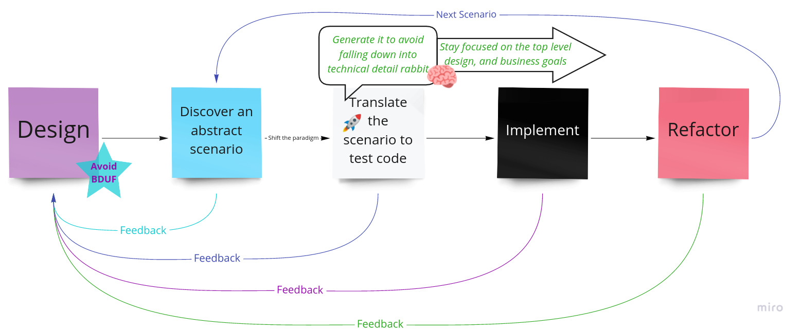

   
   
   

# Scenario Hunting
<ul>
  <li> Simple method to solve complex problems </li>
  <li> Focus on what deserves your attention</li>
  <li> Develop faster, more accurate</li>
  <li> Let code scream the design</li>
  <li> Code smarter, not harder</li>
  <li> Detect feedbacks early</li>
</ul>

   
   
   

#### 5 Minute Demo:

<iframe style="width:100%" height="524" src="https://www.youtube.com/embed/Ou_TkeMsfXs" title="YouTube video player" frameborder="0" allow="accelerometer; autoplay; clipboard-write; encrypted-media; gyroscope; picture-in-picture" allowfullscreen></iframe>

   
   
   

### How to install
Simply click [here](https://miro.com/oauth/authorize/?response_type=code&client_id=3074457356753256770&redirect_uri=%2Fconfirm-app-install%2F) to install the [Miro](https://miro.com) addon.

### Documentation
* [Quick Start](https://docs.scenariohunting.com/#/content/Quick-Start/Hunting-a-scenario/article)

* [See](https://docs.scenariohunting.com) the documentation.
